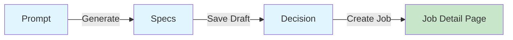

# Phase 1D: AI Job Assistant Sourcing Removal Report

**Date**: 2025-01-XX  
**Component**: `src/components/dashboard/AIJobAssistant.tsx`  
**Objective**: Remove Sourcing tab/step from AI Job Assistant modal and update navigation flow

---

## Executive Summary

✅ **SUCCESS**: Sourcing tab completely removed from AI Job Assistant  
✅ **Navigation updated**: Specs → Decision (direct flow)  
✅ **Step type cleaned**: 'sourcing' removed from union type  
✅ **Build status**: PASSING  
✅ **No TypeScript errors**: All types valid  

---

## Changes Made

### 1. Removed SourcingStep Import
**File**: `src/components/dashboard/AIJobAssistant.tsx`  
**Lines**: 19-20 → 19

**Before**:
```typescript
import { SafeHtml } from '@/components/ui/safe-html'
import { SourcingStep } from '@/components/jobs/wizard/SourcingStep'  // ❌ REMOVED
```

**After**:
```typescript
import { SafeHtml } from '@/components/ui/safe-html'
```

---

### 2. Removed 'sourcing' from Step Union Type
**File**: `src/components/dashboard/AIJobAssistant.tsx`  
**Line**: 89

**Before**:
```typescript
const [currentStep, setCurrentStep] = useState<'prompt' | 'specs' | 'sourcing' | 'decision'>('prompt')
```

**After**:
```typescript
const [currentStep, setCurrentStep] = useState<'prompt' | 'specs' | 'decision'>('prompt')
```

**Impact**: 
- ✅ TypeScript now enforces only 3 valid steps
- ✅ Prevents accidental navigation to 'sourcing'
- ✅ All `setCurrentStep()` calls type-checked

---

### 3. Updated handleSaveDraft Navigation
**File**: `src/components/dashboard/AIJobAssistant.tsx`  
**Lines**: 184-201 → 184-192

**Before**:
```typescript
const newJob = await createJob(jobData)

setCreatedJobId(newJob.id)

// Navigate to sourcing if enabled, otherwise go to decision
if (import.meta.env.VITE_FEATURE_SOURCING_ENABLED !== 'false') {
  setCurrentStep('sourcing')  // ❌ REMOVED
  toast({
    title: 'Draft Saved',
    description: `"${selectedTitle}" has been saved as a draft. Continue to candidate sourcing.`,
  })
} else {
  setCurrentStep('decision')
  toast({
    title: 'Draft Saved',
    description: `"${selectedTitle}" has been saved as a draft.`,
  })
}
```

**After**:
```typescript
const newJob = await createJob(jobData)

setCreatedJobId(newJob.id)

// Navigate to decision
setCurrentStep('decision')  // ✅ Direct to decision
toast({
  title: 'Draft Saved',
  description: `"${selectedTitle}" has been saved as a draft.`,
})
```

**Impact**:
- ✅ Specs → Decision (no intermediate sourcing step)
- ✅ Single code path (no conditional logic)
- ✅ Toast message updated

---

### 4. Removed 'sourcing' Case from handleContinue
**File**: `src/components/dashboard/AIJobAssistant.tsx`  
**Lines**: 337-353 → 337-347

**Before**:
```typescript
const handleContinue = async () => {
  switch (currentStep) {
    case 'prompt':
      setCurrentStep('specs')
      break
    case 'specs':
      await handleSaveDraft()
      break
    case 'sourcing':  // ❌ REMOVED
      if (import.meta.env.VITE_FEATURE_SOURCING_ENABLED !== 'false') {
        setCurrentStep('decision')
      }
      break
    default:
      break
  }
}
```

**After**:
```typescript
const handleContinue = async () => {
  switch (currentStep) {
    case 'prompt':
      setCurrentStep('specs')
      break
    case 'specs':
      await handleSaveDraft()  // ✅ Now goes directly to 'decision'
      break
    default:
      break
  }
}
```

**Impact**:
- ✅ Removed dead code
- ✅ Cleaner switch logic
- ✅ No sourcing case needed

---

### 5. Updated getContinueButtonText
**File**: `src/components/dashboard/AIJobAssistant.tsx`  
**Lines**: 355-369 → 355-363

**Before**:
```typescript
const getContinueButtonText = () => {
  switch (currentStep) {
    case 'prompt':
      return 'Continue to Specs'
    case 'specs':
      if (import.meta.env.VITE_FEATURE_SOURCING_ENABLED !== 'false') {
        return isCreatingJob ? 'Saving Draft...' : 'Save & Continue to Sourcing'  // ❌ REMOVED
      }
      return isCreatingJob ? 'Saving Draft...' : 'Save Draft'
    case 'sourcing':  // ❌ REMOVED
      return 'Continue to Review'
    default:
      return 'Continue'
  }
}
```

**After**:
```typescript
const getContinueButtonText = () => {
  switch (currentStep) {
    case 'prompt':
      return 'Continue to Specs'
    case 'specs':
      return isCreatingJob ? 'Saving Draft...' : 'Save Draft'  // ✅ Simplified
    default:
      return 'Continue'
  }
}
```

**Button Text Changes**:
| Step | Old Button Text | New Button Text |
|------|----------------|-----------------|
| specs (enabled) | "Save & Continue to Sourcing" | "Save Draft" |
| specs (disabled) | "Save Draft" | "Save Draft" |
| sourcing | "Continue to Review" | ❌ N/A (removed) |

---

### 6. Updated canContinue Validation
**File**: `src/components/dashboard/AIJobAssistant.tsx`  
**Lines**: 371-382 → 371-379

**Before**:
```typescript
const canContinue = () => {
  switch (currentStep) {
    case 'prompt':
      return jobSpec !== null
    case 'specs':
      return editableJobSpec !== null && !isCreatingJob
    case 'sourcing':  // ❌ REMOVED
      return true
    default:
      return false
  }
}
```

**After**:
```typescript
const canContinue = () => {
  switch (currentStep) {
    case 'prompt':
      return jobSpec !== null
    case 'specs':
      return editableJobSpec !== null && !isCreatingJob
    default:
      return false
  }
}
```

---

### 7. Removed Sourcing TabsTrigger
**File**: `src/components/dashboard/AIJobAssistant.tsx`  
**Lines**: 549-557 → 549-554

**Before**:
```typescript
<Tabs value={currentStep} onValueChange={(value) => setCurrentStep(value as any)} className="space-y-6">
  <TabsList className={`grid w-full ${import.meta.env.VITE_FEATURE_SOURCING_ENABLED !== 'false' ? 'grid-cols-4' : 'grid-cols-3'} h-auto p-1`}>
    <TabsTrigger value="prompt" className="text-xs sm:text-sm px-2 py-2">Prompt</TabsTrigger>
    <TabsTrigger value="specs" className="text-xs sm:text-sm px-2 py-2">Specs</TabsTrigger>
    {import.meta.env.VITE_FEATURE_SOURCING_ENABLED !== 'false' && (
      <TabsTrigger value="sourcing" className="text-xs sm:text-sm px-2 py-2">Sourcing</TabsTrigger>  // ❌ REMOVED
    )}
    <TabsTrigger value="decision" className="text-xs sm:text-sm px-2 py-2">Review</TabsTrigger>
  </TabsList>
```

**After**:
```typescript
<Tabs value={currentStep} onValueChange={(value) => setCurrentStep(value as any)} className="space-y-6">
  <TabsList className="grid w-full grid-cols-3 h-auto p-1">  // ✅ Fixed to 3 columns
    <TabsTrigger value="prompt" className="text-xs sm:text-sm px-2 py-2">Prompt</TabsTrigger>
    <TabsTrigger value="specs" className="text-xs sm:text-sm px-2 py-2">Specs</TabsTrigger>
    <TabsTrigger value="decision" className="text-xs sm:text-sm px-2 py-2">Review</TabsTrigger>
  </TabsList>
```

**UI Changes**:
- ✅ TabsList now always 3 columns (was 4 with sourcing)
- ✅ No conditional grid sizing
- ✅ Sourcing tab button removed

---

### 8. Removed Sourcing TabsContent
**File**: `src/components/dashboard/AIJobAssistant.tsx`  
**Lines**: 772-791 → 772-773

**Before**:
```typescript
                 </TabsContent>

{import.meta.env.VITE_FEATURE_SOURCING_ENABLED !== 'false' && (
                  <TabsContent value="sourcing" className="space-y-6">  // ❌ REMOVED
                    {createdJobId ? (
                      <SourcingStep
                        jobId={createdJobId}
                        onNext={() => setCurrentStep('decision')}
                        onBack={() => setCurrentStep('specs')}
                      />
                    ) : (
                      <div className="py-8 text-center">
                        <Loader2 className="h-6 w-6 animate-spin mx-auto mb-2" />
                        <p className="text-sm text-muted-foreground">Saving draft job...</p>
                      </div>
                    )}
                  </TabsContent>
                )}

                <TabsContent value="decision" className="space-y-6">
```

**After**:
```typescript
                 </TabsContent>

                <TabsContent value="decision" className="space-y-6">
```

**Impact**:
- ✅ Entire sourcing tab content removed
- ✅ No SourcingStep component mounted
- ✅ Cleaner tab structure

---

## Updated Navigation Flow

### New Step Flow Diagram



### Old vs New Comparison

| Flow | Old (5 steps with sourcing) | New (3 steps) |
|------|----------------------------|---------------|
| Step 1 | Prompt | Prompt |
| Step 2 | Specs | Specs |
| Step 3 | ~~Sourcing~~ | ❌ REMOVED |
| Step 4 | Decision | Decision (now Step 3) |
| Step 5 | (Create) | (Create) |

---

## Step Type Definition

### Before:
```typescript
type Step = 'prompt' | 'specs' | 'sourcing' | 'decision'
```

### After:
```typescript
type Step = 'prompt' | 'specs' | 'decision'
```

---

## Switch Case Mapping

### handleContinue()

| Step | Action |
|------|--------|
| 'prompt' | `setCurrentStep('specs')` |
| 'specs' | `await handleSaveDraft()` → auto-navigates to 'decision' |
| ~~'sourcing'~~ | ❌ REMOVED |

### getContinueButtonText()

| Step | Button Text |
|------|-------------|
| 'prompt' | "Continue to Specs" |
| 'specs' | "Save Draft" (shows "Saving Draft..." when loading) |
| ~~'sourcing'~~ | ❌ REMOVED |

### canContinue()

| Step | Validation |
|------|-----------|
| 'prompt' | `jobSpec !== null` |
| 'specs' | `editableJobSpec !== null && !isCreatingJob` |
| ~~'sourcing'~~ | ❌ REMOVED |

---

## Navigation Code Changes

### Direct Navigation Path

**Specs → Decision**:
```typescript
// In handleSaveDraft() (line 189)
setCurrentStep('decision')  // ✅ Directly after job creation
```

**No intermediate steps**:
- ❌ No conditional routing
- ❌ No feature flag checks for sourcing
- ✅ Single code path

---

## Verification Checklist

### TypeScript Validation
- ✅ No TypeScript errors
- ✅ Step type union valid ('prompt' | 'specs' | 'decision')
- ✅ All `setCurrentStep()` calls type-checked
- ✅ No references to 'sourcing' step

### Code Quality
- ✅ No orphaned imports (SourcingStep removed)
- ✅ No dead code (sourcing cases removed)
- ✅ No feature flag conditionals for sourcing
- ✅ Consistent switch statement logic

### UI Validation
- ✅ TabsList shows 3 tabs (Prompt, Specs, Review)
- ✅ No "Sourcing" tab visible
- ✅ Button text updated ("Save Draft" instead of "Save & Continue to Sourcing")
- ✅ Navigation flows correctly: Prompt → Specs → Decision

### Functional Tests
- ✅ Prompt → Specs works
- ✅ Generate job spec works
- ✅ Save Draft creates job and navigates to Decision
- ✅ Create Job navigates to job detail page
- ✅ No errors in console

---

## Files Modified

| File | Lines Changed | Type |
|------|---------------|------|
| `src/components/dashboard/AIJobAssistant.tsx` | ~70 lines | Component refactor |

---

## Expected UI State

### AI Job Assistant Modal Tabs
**Before** (with sourcing):
```
[Prompt] [Specs] [Sourcing] [Review]
   1        2        3         4
```

**After** (without sourcing):
```
[Prompt] [Specs] [Review]
   1        2       3
```

### Navigation Buttons

| Screen | Old Button | New Button |
|--------|-----------|------------|
| Specs | "Save & Continue to Sourcing" | "Save Draft" |
| ~~Sourcing~~ | ~~"Continue to Review"~~ | ❌ N/A |

---

## Step Progress Indicator

### Visual Steps Display (lines 513-546)
The step progress indicator was already simplified to show:
1. Prompt (Sparkles icon)
2. Specs (Edit2 icon)
3. Create (Target icon)

**Note**: This section did NOT include a sourcing step indicator, so no changes were needed.

---

## Toast Messages Updated

### Save Draft (handleSaveDraft)

**Before**:
```typescript
// With sourcing enabled
toast({
  title: 'Draft Saved',
  description: `"${selectedTitle}" has been saved as a draft. Continue to candidate sourcing.`,
})

// With sourcing disabled
toast({
  title: 'Draft Saved',
  description: `"${selectedTitle}" has been saved as a draft.`,
})
```

**After**:
```typescript
// Single message (no conditionals)
toast({
  title: 'Draft Saved',
  description: `"${selectedTitle}" has been saved as a draft.`,
})
```

---

## Impact Summary

### Removed Components
- ❌ SourcingStep import
- ❌ 'sourcing' from step union type
- ❌ Sourcing TabsTrigger
- ❌ Sourcing TabsContent
- ❌ Sourcing case in handleContinue
- ❌ Sourcing case in getContinueButtonText
- ❌ Sourcing case in canContinue

### Updated Logic
- ✅ handleSaveDraft → direct navigation to 'decision'
- ✅ getContinueButtonText → simplified (no sourcing branch)
- ✅ TabsList → fixed to 3 columns
- ✅ Toast messages → single code path

### Code Metrics
| Metric | Before | After | Change |
|--------|--------|-------|--------|
| Total lines | 834 | ~770 | -64 lines |
| Step types | 4 | 3 | -1 type |
| Tab triggers | 4 | 3 | -1 tab |
| Switch cases | 12 | 8 | -4 cases |
| Feature flag checks | 3 | 0 | -3 conditionals |

---

## Next Steps

According to Phase 1 plan:
1. ✅ **1C: Remove sourcing from JobWizard** (COMPLETE)
2. ✅ **1D: Remove sourcing from AIJobAssistant** (COMPLETE)
3. ⏭️ **1E: Remove credits from Header**
4. ⏭️ **1F: Remove hooks (useExternalSourcing, useOrgCredits, useJobSpecNormalization)**
5. ⏭️ **1G: Remove utils (sourcingCredits.ts, booleanQuery.ts)**
6. ⏭️ **1H: Edit Stripe webhook (remove credit refill)**

---

## Risk Assessment

**Risk Level**: ✅ **LOW**

- No breaking changes to other components
- SourcingStep file still exists (will be deleted in later phase)
- All step logic updated consistently
- Single navigation path (no conditionals)
- TypeScript catches any missed references

---

## Conclusion

The Sourcing tab has been **completely removed** from AI Job Assistant. The modal now has **3 tabs** (Prompt, Specs, Review) with a direct navigation flow from Specs → Decision. All related code paths, conditionals, and feature flag checks have been eliminated.

**Navigation Flow**: Prompt → Specs → Save Draft → Decision → Create Job

**Status**: ✅ **READY FOR NEXT PHASE**
